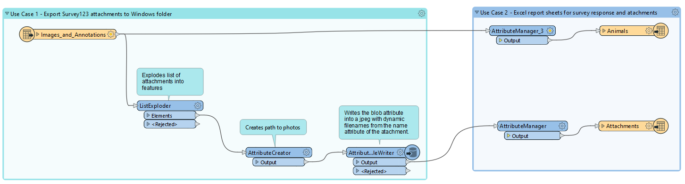
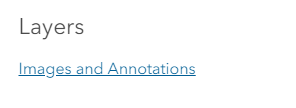
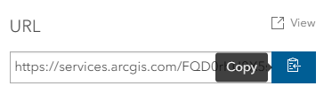
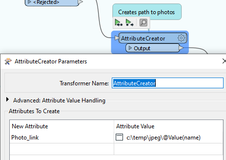
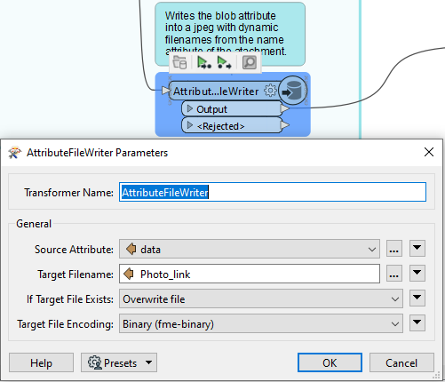
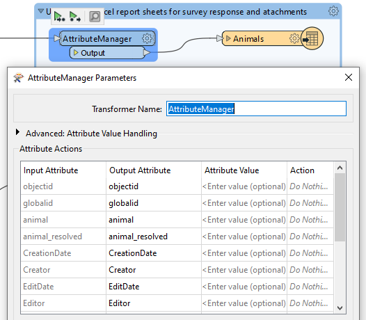

# Exporting Survey123 responses to Excel report (FMW)

## Solution details
The zipped workspace or fmw file is a no-code solution to export attachments from a feature service to an Excel workbook. It reads all the features of a Survey123 feature layer using the [AGOL Server Feature Service reader](https://docs.safe.com/fme/html/FME_Desktop_Documentation/FME_ReadersWriters/arcgisonlinefeatures/arcgisfeatures.htm). 

This solution is an enhancement of [Use Case 1](/Use%20case%201%20-%20Export%20survey%20attachment%20to%20windows%20folder(Workbench)/README.md).

An organization and documentation feature called Bookmarks is used in this solution. This is a best practice pattern that you should use in your workspace. There's one Bookmark that contain an imroved version of Use Case 1. A second bookmark is added to complete the solution.

Below is a screenshot of the solution.  

 

> [!NOTE] 
> **Prerequisites**
> - A Survey123 feature service with image attachments. A [sample feature service](https://pm.maps.arcgis.com/home/item.html?id=1a4a4e91484d4175b340b7f8b9a1dfa3) is publicly available for this blog. You are welcome to submit a survey.
> - An AGOL Organizational account. (optional-for services shared to Everyone)
> - Configure a Web Connection of your AGOL account in the Tools Options menu of the Workbench app. (optional-for services shared to Everyone)
> - Identify the destination folder for your attachments (e.g. c:\temp\jpeg)

## Instructions

### Bookmark 1
1. Download and unzip the S123DITool_ExportSurveyToExcel.zip file from this repo folder and open the fmw file by double clicking the zipped file on your Doenloads folder. This will launch the Wokbench app and open the workspace.

2. Copy the service URL from the Portal item by clicking on this [portal item](https://pm.maps.arcgis.com/home/item.html?id=1a4a4e91484d4175b340b7f8b9a1dfa3). 

        a. Scroll down to layers and click on "Images and Annotations" link.

        

        b. The feature service item opens in a new browser. Scroll down to the bottom right of the page and copy the Service URL of the service.

        

3. On your canvass begin typing ArcGIS Server and select the ArcGIS Server Feature Service format reader.

4. You will be prompted with the Add reader dialog.

        a. Click on Parameters, select the Web Connection that you created above. (Use None for authentication type if you're using the blog sample)

        b. Click on the ellipsis next to the Feature service textbox, then browse to your feature service, select your service and clck OK.

        c. Back to the Feature Service parameter dialog, click on Layers ellipsis and select your Survey123 form's feature layer.

        d. Click on Schema Attributes and select the Attributes to Expose as shown in the picture below.

        (Optional) Select Yes on the Resolve Domains drop-down if you used the Choice questions in your survey.

        e. Click Ok twice.

5. Connect the Feature service feature type to the List Exploder. Once connected, you can delete the original feature type in your canvass. 

5. Now that the new feature type is on your canvass, we will configure it for our transformation.

        a. Click on the cog wheel of the feature type to open its properties dialog.

        b. On the Parameters tab, select Yes on the Include Attachments drop-down, as shown in the picture below.

        c. On the Format Attributes tab, check if all attributes that begin with arcgisonline_ are exposed. If you prefer, use the filter box at the bottom and Select All. 

        d. This feature type is now configured.

6. We need the file path of each picture in the translation so we added the AttributeCreator for this purpose.  Configure the AttributeCreator as shown.

7. Since our file path is now an attribute, we can replace the target directory with the file path attribute created from Step 6. Configure the AttributeFileCreator as shown.

8. Now we're ready to build the Excel report.

### Bookmark 2
1. Configure AttributeManager as shown.

2. Configure AttributeManager_1 as shown.

3. Add the Excel format writer to your canvass.

        a. Click on Parameters, select the Web Connection that you created above. (Use None for authentication type if you're using the blog sample)

        b. Click on the ellipsis next to the Feature service textbox, then browse to your feature service, select your service and clck OK.

        c. Back to the Feature Service parameter dialog, click on Layers ellipsis and select your Survey123 form's feature layer.

        d. Click on Schema Attributes and select the Attributes to Expose as shown in the picture below.

        (Optional) Select Yes on the Resolve Domains drop-down if you used the Choice questions in your survey.

        e. Click Ok twice.

[image](https://github.com/salvaleonrp/survey123-tools-no-code-required/assets/87094963/b56b419e-3ee9-4667-9319-3edacf2ed54f.png)

## Requirements

* ArcGIS Pro 3.1 or higher
* Data Interoperability for ArcGIS Pro 3.1 or higher
* [Survey123 form used](https://pm.maps.arcgis.com/home/item.html?id=1a4a4e91484d4175b340b7f8b9a1dfa3) for the blog or you own service with collected data and attachments. 

## Resources

Below are links to related resources to this workflow.

1. [Survey123 Media questions](https://doc.arcgis.com/en/survey123/desktop/create-surveys/xlsformmedia.htm) 
2. Enhancement solutions for this tool:   
        a. More detailed solution with HTML reporting from Safe[ArcGIS attachments](http://imgscloudapps.com/Training/arcgis/1-Exercises/arcgisattachments/arcgisattachments/) 
        b. From AGOL into storing the attachment in another GDB  
        [Writing ArcGIS Geodatabase Attachments](https://community.safe.com/s/article/writing-arcgis-geodatabase-attachments) 
        [Code Free Web Integration, With a Touch of ArcPy](https://community.esri.com/t5/arcgis-data-interoperability-blog/code-free-web-integration-with-a-touch-of-arcpy/ba-p/883683) 
        c. [Safe Community question - Writing Portal for ArcGIS (or AGOL) image attachments to SDE](https://community.safe.com/s/question/0D54Q000080hay7SAA/writing-portal-for-arcgis-or-agol-image-attachments-to-sde-relationship-class-ok-but-image-is-not-valid) 

## Issue/s
Find a bug or want to request a new feature?  Please let us know by submitting an issue.

1. In the Schema list attribute of the feature service as shown in Instructions, item 5 above, notice that the arcgisonline_attachment{}.globalid attribute is exposed but the translation does not display it. This is a known bug and is reported in FMEENGINE-74184. For reference see the comments section of this [Question]([url](https://community.safe.com/s/question/0D54Q00009PK7llSAD/read-arcgis-online-attachments-and-maintain-globalids-for-both-features-and-attachments)) found in the Safe Community web page.

